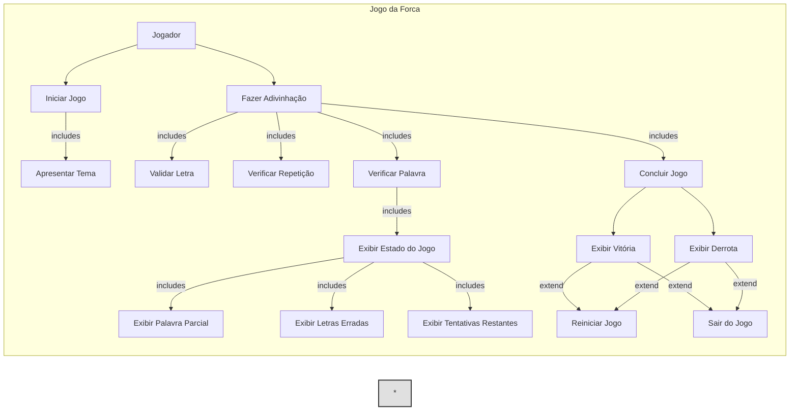
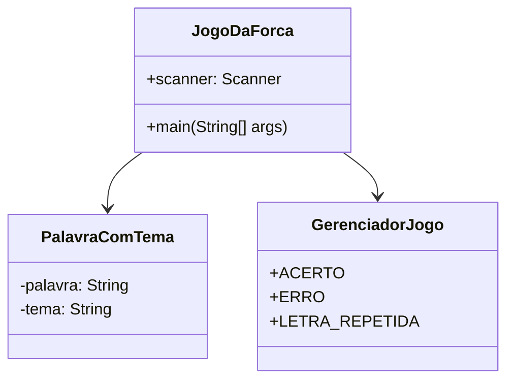
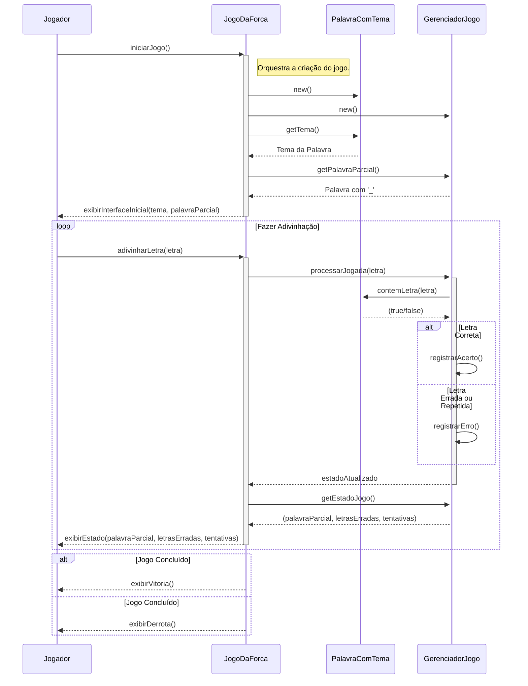
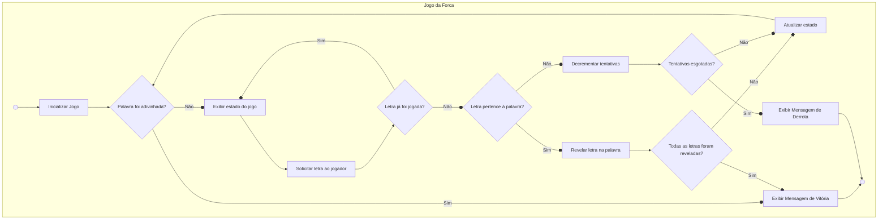

# Documentação do Projeto - Jogo da Forca

Este documento contém os diagramas de engenharia de software que modelam o sistema do Jogo da Forca.

## 1. Diagrama de Caso de Uso

O diagrama a seguir descreve as principais interações do ator "Jogador" com o sistema.

## 2. Diagrama de Classes

Este diagrama mostra as principais classes do sistema, seus atributos, métodos e os relacionamentos entre elas.

## 3. Diagrama de Sequência

O diagrama de sequência ilustra a ordem das interações entre os objetos do sistema durante uma partida.

## 4. Diagrama de Atividade

O diagrama de atividade detalha o fluxo de trabalho do jogo, desde o início até a conclusão da partida.

