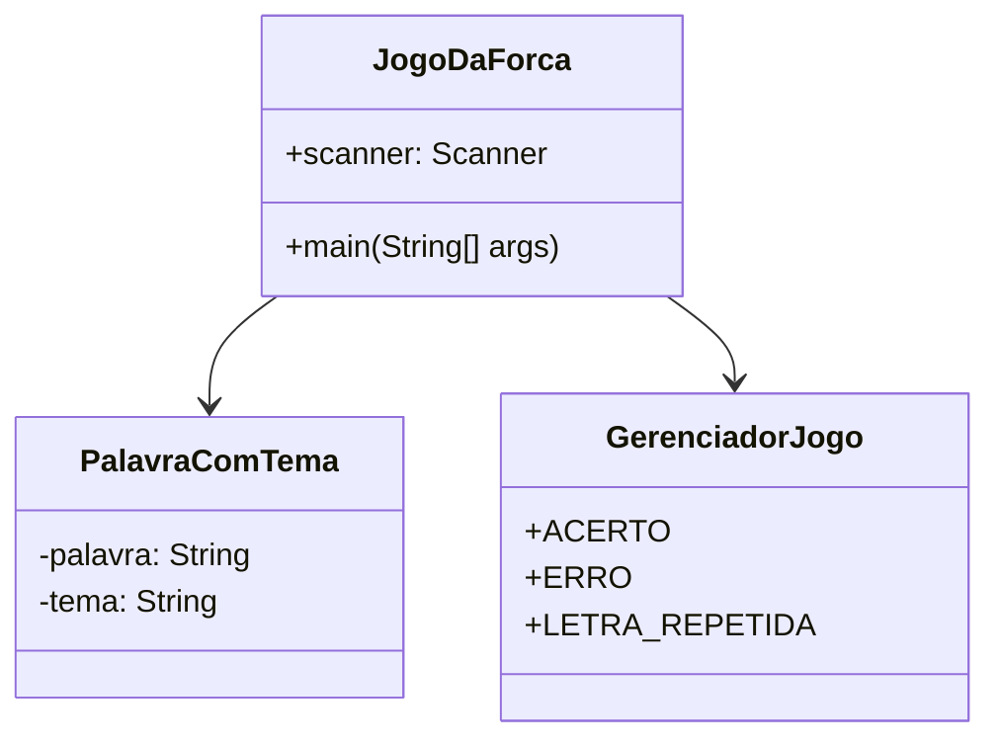
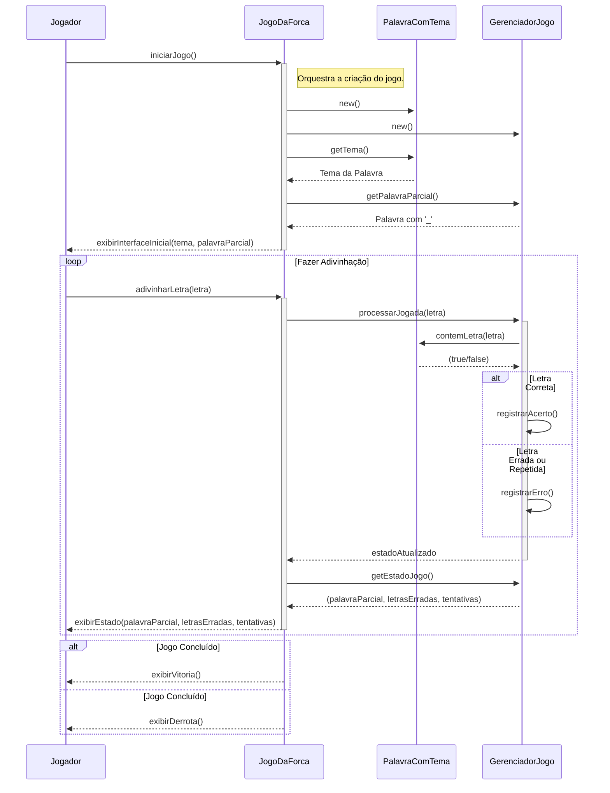
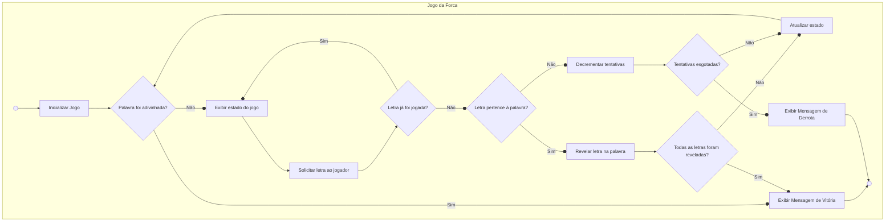

# Documentação do Projeto - Jogo da Forca

Este documento contém os diagramas de engenharia de software que modelam o sistema do Jogo da Forca.

## 1. Diagrama de Caso de Uso

O diagrama a seguir descreve as principais interações do ator "Jogador" com o sistema.

```mermaid
graph TD
    subgraph Jogo da Forca
        A(Iniciar Jogo)
        B(Fazer Adivinhação)
        C(Concluir Jogo)
        D(Exibir Estado do Jogo)
        E(Validar Letra)
        F(Verificar Repetição)
        G(Verificar Palavra)
        H(Apresentar Tema)
        I(Exibir Vitória)
        J(Exibir Derrota)
        K(Exibir Palavra Parcial)
        L(Exibir Letras Erradas)
        M(Exibir Tentativas Restantes)
        N(Reiniciar Jogo)
        O(Sair do Jogo)
    end

    Jogador --> A
    A --o|includes| H
    Jogador --|> B
    B --o|includes| E
    B --o|includes| F
    B --o|includes| G
    G --o|includes| D
    D --o|includes| K
    D --o|includes| L
    D --o|includes| M
    B --o|includes| C
    C --|> I
    C --|> J
    I -.->>|extend| N
    I -.->>|extend| O
    J -.->>|extend| N
    J -.->>|extend| O

    classDef default fill:#f9f,stroke:#333,stroke-width:2px;
```

## 2. Diagrama de Classes

Este diagrama mostra as principais classes do sistema, seus atributos, métodos e os relacionamentos entre elas.



## 3. Diagrama de Sequência

O diagrama de sequência ilustra a ordem das interações entre os objetos do sistema durante uma partida.



## 4. Diagrama de Atividade

O diagrama de atividade detalha o fluxo de trabalho do jogo, desde o início até a conclusão da partida.

